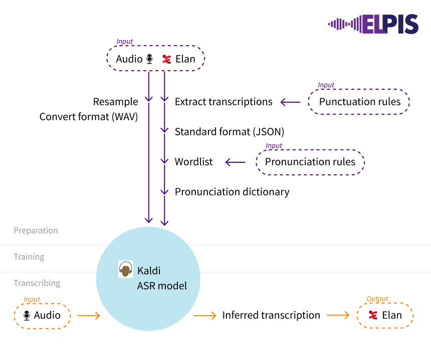

# Elpis (Accelerated Transcription for Linguists) 

## What is Elpis?

Elpis is a tool which allows language workers with minimal computational experience to build their own speech models 
for use in automatically transcribing audio. It relies on the [Kaldi](http://kaldi-asr.org) automatic speech recognition 
(ASR) library. Kaldi is notorious for being difficult to build, use and navigate - even for trained computer scientists. 
The goal of Elpis is to expose the power of Kaldi to linguists and language workers by abstracting away much of the 
needless technical complexity.

Elpis grew out of the [kaldi_helpers](https://github.com/CoEDL/kaldi_helpers) project, a collection of 
Python and shell scripts designed to prepare data for use with Kaldi and convert between the various time-aligned 
transcription formats that linguists work with. These scripts now make up the core of Elpis' input preparation and output
conversion engines.

## How Does It Work?

Elpis uses [Docker](https://www.docker.com/), specifically an [Ubuntu Linux](https://www.ubuntu.com/) image, to install
Kaldi and its (many) dependencies in an Ubuntu linux environment. Elpis itself consists of wrappers around Kaldi file 
system objects, a [Flask](http://flask.pocoo.org/) server, and a web-based graphical user interface written in 
[React](https://reactjs.org/) (maintained in a separate repository [here](https://github.com/CoEDL/elpis-gui)).

## How Do I Use It?

Please check the [wiki](https://github.com/CoEDL/elpis/wiki/2019-ICLDC-Workshop-Steps) pages for a step-by-step guide to
using Elpis on your data. 

If you want to play around with Elpis' internals, or contribute to development we recommend
cloning this repository and building the Docker image, but without the Docker `ENTRYPOINT` (you can simply comment it 
out or pass the argument `--entrypoint="bin/bash"` when starting up the Docker image).

### Requirements

All of the required dependencies are included in the Docker image provided, including Kaldi, Python 3 etc.

## Why Is It Called Elpis?

Elpis is the Greek goddess of hope. For us Elpis represents our hope that one day everyone will have access to 
the power of ASR without having to interact directly with the [Kaldi codebase](https://github.com/kaldi-asr/kaldi).
We've also backronymed it to stand for "Endangered Language Pipeline and Inference System," as much of our motivation 
for this project derives from our desire to assist in documentation and revitalisation efforts for the world's many
endangered languages - including many in Australia, where most of Elpis' development has occurred.

## I'm having trouble!
This project is under construction and not yet stable. Please contact us by email at `elpis.asr@gmail.com` 
for project status information and support getting started.

## I'm An Academic, How Do I Cite This In My Research?

This software is the product of academic research funded by the Australian Research Council 
[Centre of Excellence for the Dynamics of Language](http://www.dynamicsoflanguage.edu.au/). If you use the software in 
an academic setting, please be sure to cite it appropriately as follows:

> Foley, B., Arnold, J., Coto-Solano, R., Durantin, G., Ellison, T. M., van Esch, D., Heath, S., Kratochvíl, F.,
Maxwell-Smith, Z., Nash, D., Olsson, O., Richards, M., San, N., Stoakes, H., Thieberger, N. & Wiles,
J. (2018). Building Speech Recognition Systems for Language Documentation: The CoEDL Endangered
Language Pipeline and Inference System (Elpis). In S. S. Agrawal (Ed.), *The 6th Intl. Workshop on Spoken
Language Technologies for Under-Resourced Languages (SLTU)* (pp. 200–204). Available on https://www.isca-speech.org/archive/SLTU_2018/pdfs/Ben.pdf.

     
    

