# Getting started

# Overview

The speech recognition process (also called speech to text) broadly involves steps of:

- Organising files that will be used to train the system
- Making pronunciation rules for your language
- Acoustic, pronunciation and language training

Then, using the trained system we can get a new transcription on un-transcribed recordings.

<!--
---

- [Setup](#setup)
  * [Get some training files](#get-some-training-files)
  * [Start Elpis](#start-elpis)
- [Transcription Types](#transcription-types)
- [Recordings](#recordings)
  * [Add files](#add-files)
  * [Select tiers](#select-tiers)
  * [Prepare](#prepare)
- [Pronunciation Dictionary](#pronunciation-dictionary)
  * [Letter to sound rules](#letter-to-sound-rules)
  * [Pronunciation](#pronunciation)
- [Training sessions](#training-sessions)
  * [Settings](#settings)
  * [Training](#training)
  * [Results](#results)
- [Making a new transcription](#making-a-new-transcription)
- [More information about training files](#more-information-about-training-files)


--- 
-->

# Setup


## Get some training files

Start with downloading some files to use during the workshop. [Download a zip of the files here](http://bit.ly/elpis-toycorpora). The recordings in this zip are Abui language (abz) provided by František Kratochvíl, and Yongning Na language (nru) provided by Alexis Michaud and Oliver Adams.

After the zip file has downloaded, unzip it to create a folder somewhere handy (for example, your Desktop).  


## Start Elpis

- We will provide a list of servers on the workshop day.
- Get an address from the list.
- If you are using Elpis in Docker on your own computer, the address will be `0.0.0.0:5000`
- Open a new web browser (Chrome or Firefox).
- Paste the address into the location bar.
- Press Enter/Return to start Elpis.
- When Elpis starts it looks like this.

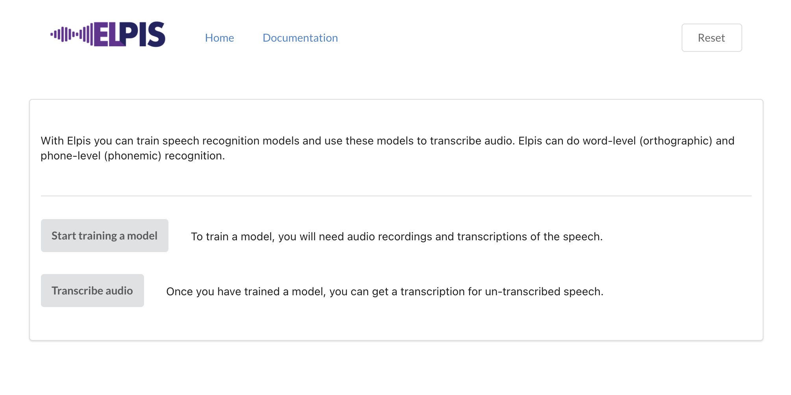

This is the Welcome page. To come back here anytime, you can click `Home` in the top menu. 

Also in the top menu is a link to this Elpis documentation.

The `Reset` button will reset Elpis, removing all the recordings and models that you have started. It won't affect any of your original files.

On the Welcome page we have two options: to *train a model* and to *transcribe audio*. First, we need to train the speech recognition system. We are planning to include some pre-trained systems in Elpis to make things easier. For now, we will start by training Elpis, so click `Start training a model`.

Once we have trained a system we can use it to transcribe.


*A model is the system that Elpis learns about the language, based on the recordings and transcriptions that you provide.* 


---

# Transcription types

Elpis has two transcription methods. It can be trained to recognise *words* or *phonemes*. 

To train Elpis to recognise words in speech, we will need to provide 
  1) some recordings
  2) transcriptions of the audio
  3) and for word recognition it needs some information about the way the words are pronounced. 
     

For word recognition, Elpis will try to create a pronunciation dictionary from some rules which we give it in a [letter-to-sound](https://raw.githubusercontent.com/CoEDL/toy-corpora/master/abui-recordings-elan/letter_to_sound.txt) file. We'll see an example of this soon. In other tools this is called grapheme-to-phoneme or G2P. 

The Elpis phoneme level recognition method doesn't require the pronunciation rules, just audio and transcriptions.

Elpis currently uses ELAN format for the transcriptions. We are working on supporting other formats, please let us know what you need. Transcriptions don't need to be at individual word or phoneme level, the best length is at "utterance" level of around ten second duration. For more information about preparing your own files, see the [Preparing files](preparing-files.md) page.

For this workshop, we will choose the `Word` method.

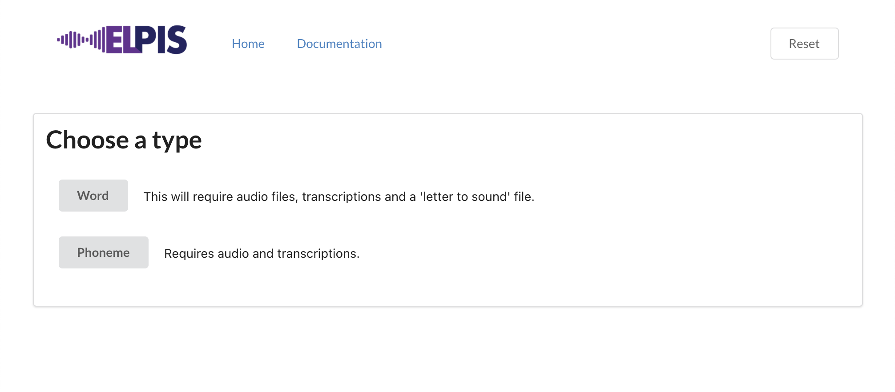


---

# About the steps

There are four main steps in Elpis, with sub-steps in each.

1. Recordings
2. Pronunciation Dictionary
3. Training
4. New transcriptions

**Recordings** is where we collect and prepare the audio and text to train Elpis.

The **Pronunciation Dictionary** is where the system works out how the text words from the Recordings step are pronounced.  
This step is skipped when doing phoneme transcription.

**Training** is where the speech recognition models are built.

**New transcriptions** is the place we go to use an existing training session to obtain a first-pass transcription on new audio.


---


# Recordings

We can do multiple sessions with Elpis. To keep track of which group of files we are using, give them a name here. For example, if you are using the Abui sample recordings, you could name this "Abui recordings". Then click `Add New`

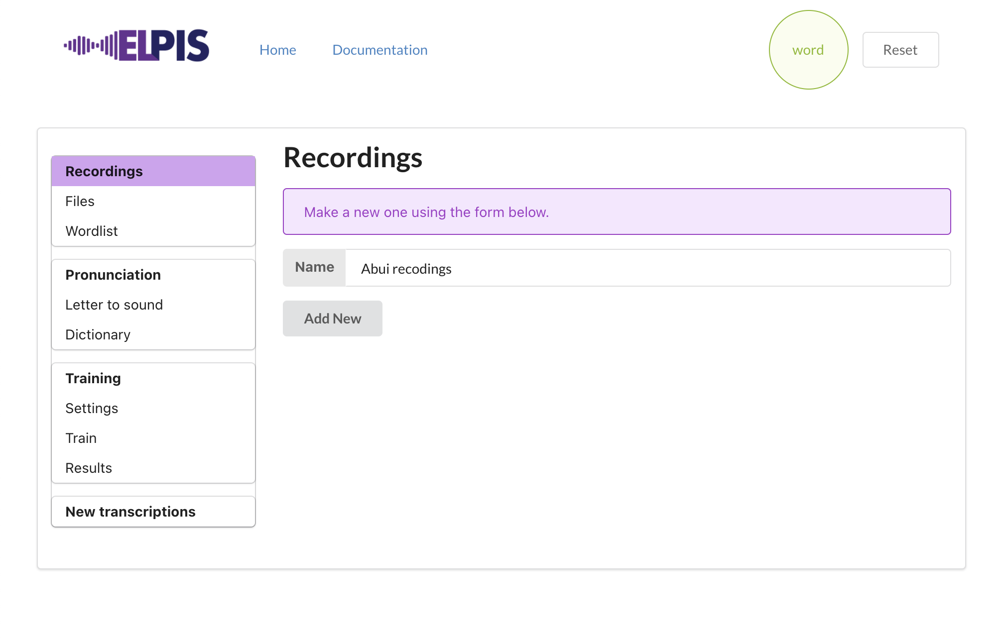


## Add files

On the *Add files* page, click inside the dotted area and go to where you downloaded the Abui files. Open the `transcribed` folder, select all the *wav* and *eaf* files and add them.

You can add additional words by uploading a wordlist in a plain text file named `additional_word_list.txt`, or a text corpus (with sentences) named `corpus.txt`. These are optional files. Words in either of these uploaded files will extend the pronunciation lexicon. Content in corpus.txt will also be used by the language model.

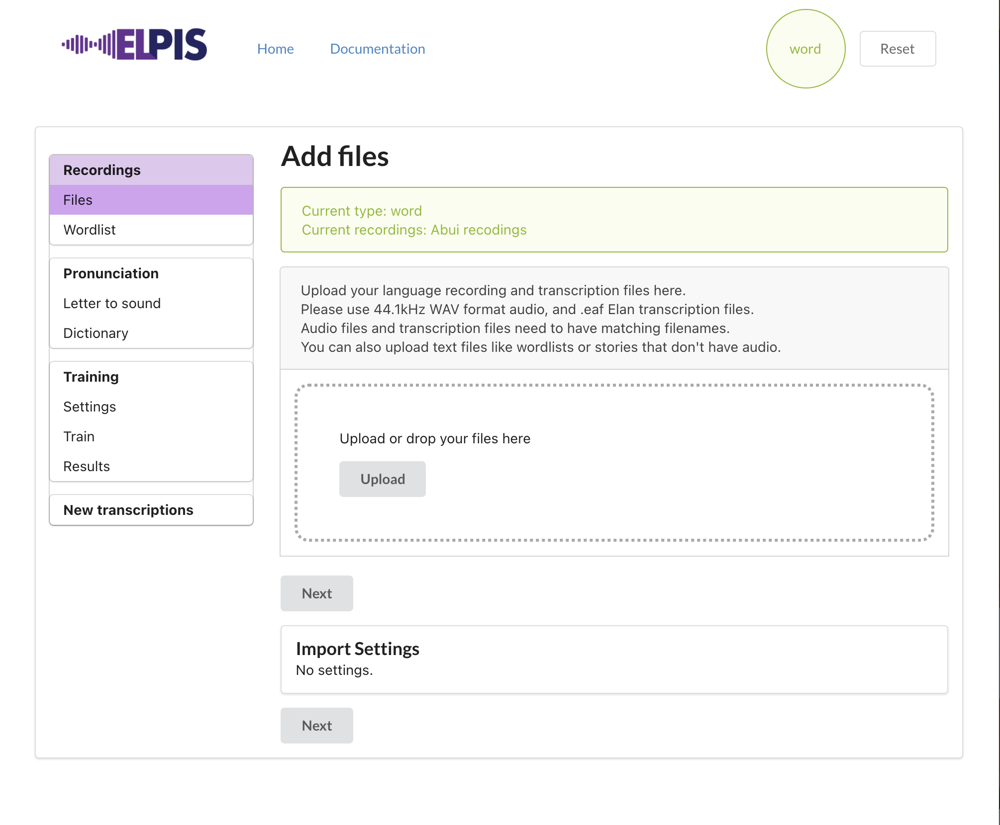


## Select tiers

Elan files can have multiple tiers for transcription, glosses, translations, etc. For training, we need to select the tier that contains the transcription text.

Elpis reads the Elan files you uploaded. The tier names and tier types from the files are shown here to choose from, or you can choose a tier by order - the top-most tier in all files would be selected by choosing `0`, the second tier would be selected by choosing `1`.   

Select one of the Tier options. For the Abui files, choose `Tier Name` for the Selection, and `Phrase`as the Tier name.  

For this workshop there is no need to change the punctuation settings. For more info about what this setting does please get in touch.

Then click `Next`.

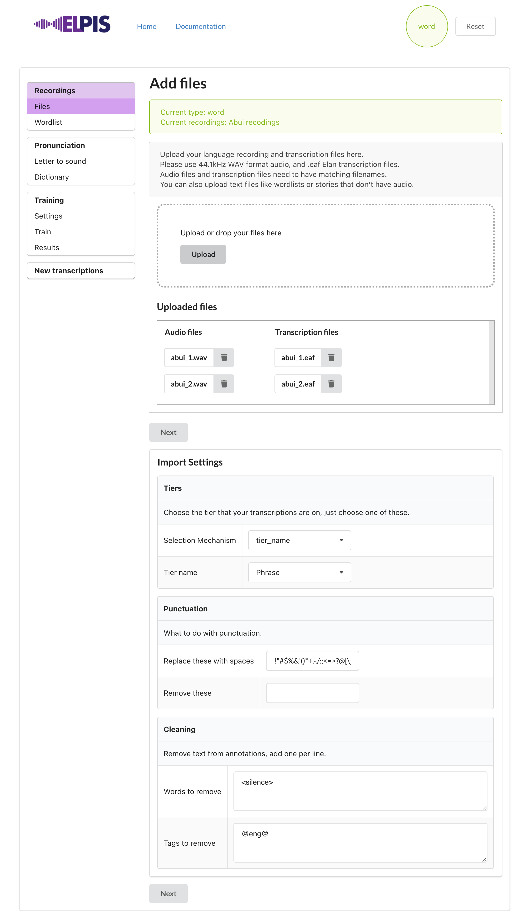


## Prepare

On the *Prepare* page we can see how Elpis has read your transcription files. If you have lots of training text there will be a delay while the text is prepared.

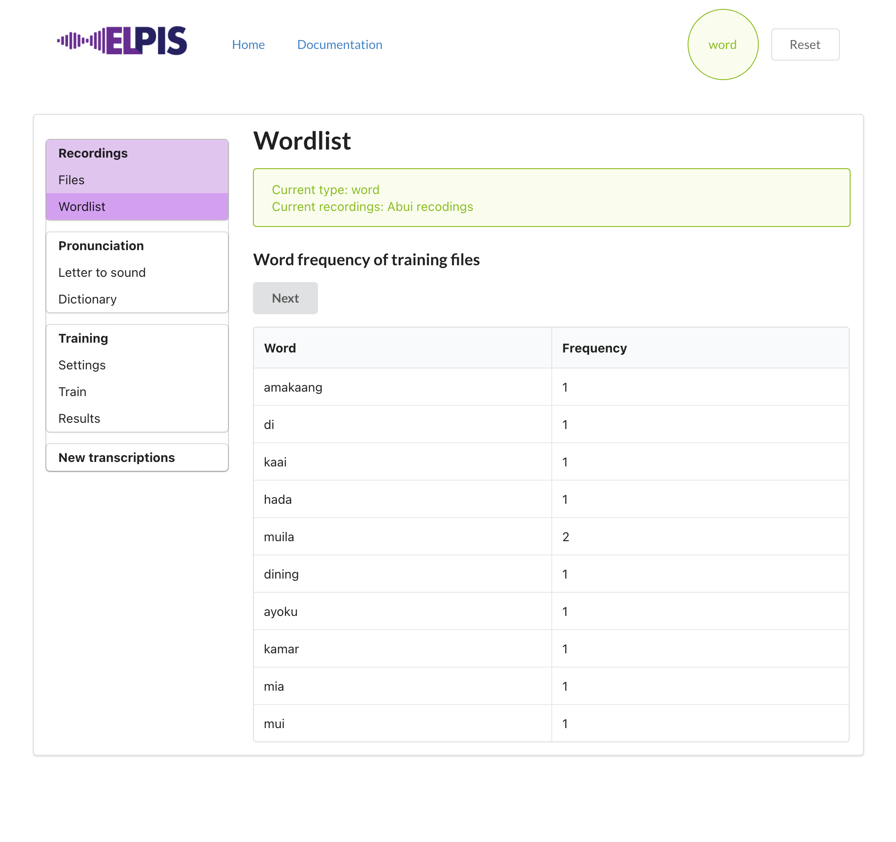


---

# Pronunciation Dictionary

For a word recognition system, the pronunciation dictionary is made so the system knows how words are pronounced. Elpis will make a rough draft for the words in the wordlist, based on a letter-to-sound file which you provide. This step is not required for phoneme recognition.

Like the recordings step, give this step a name. For example "Abui pronunciation"

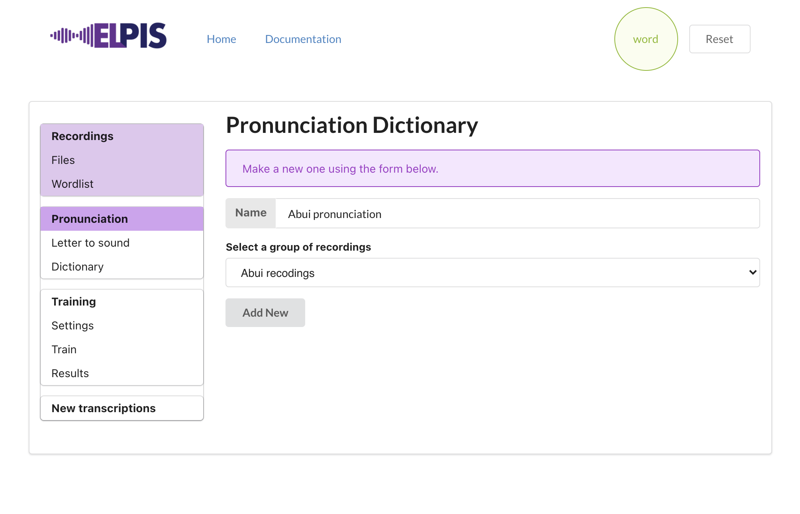


## Letter to sound rules

The letter-to-sound file is a text file of rules mapping your orthography into phonemic transcription. Elpis will use it to build a pronunciation dictionary for the words in the transcriptions you uploaded.

It is formatted in two columns, space separated.The left column is all the characters in your corpus. The right column is a symbol representing the sound. You can use IPA or SAMPA for the right column. 

Comments can be written in the file with a `#` starting the comment line. 

Here's a section of the Abui one:

```
# Abui
j J
f f
s s
h h
m m
n n
ng ŋ
r r
```
> Note that the file has to have particular text format. On Windows, use the free utility Notepad++ to convert CrLf to Lf in one go (Edit > EOL Conversion > Unix Format).

Upload the letter to sound rules [`letter_to_sound.txt`](https://raw.githubusercontent.com/CoEDL/toy-corpora/master/abui-recordings-elan/letter_to_sound.txt) from the Abui folder.

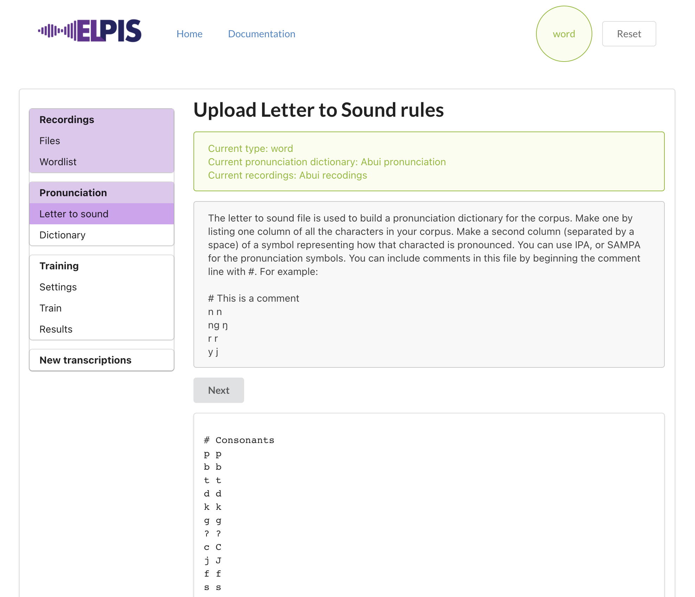


## Pronunciation

Elpis uses the letter to sound file we uploaded to make a breakdown of how each word in our training files might be pronounced. For some languages the simple technique that Elpis uses will be accurate, for other languages, the results will need to be corrected. 

Scroll through the list and review the results. 

If corrections are required, you can type your changes in this field. After making corrections, press `Save`. Press the `Reset` button that is below the pronunciation text if you want to undo your changes and reset back to the rough draft.

If you notice characters in brackets e.g. `(h)`, this indicates that the word includes a letter that is not covered in the letter-to-sound file. To correct this, add a letter to sound line in your letter-to-sound file for this letter, go back and make a new Pronunciation Dictionary, then upload the letter-to-sound file again. 

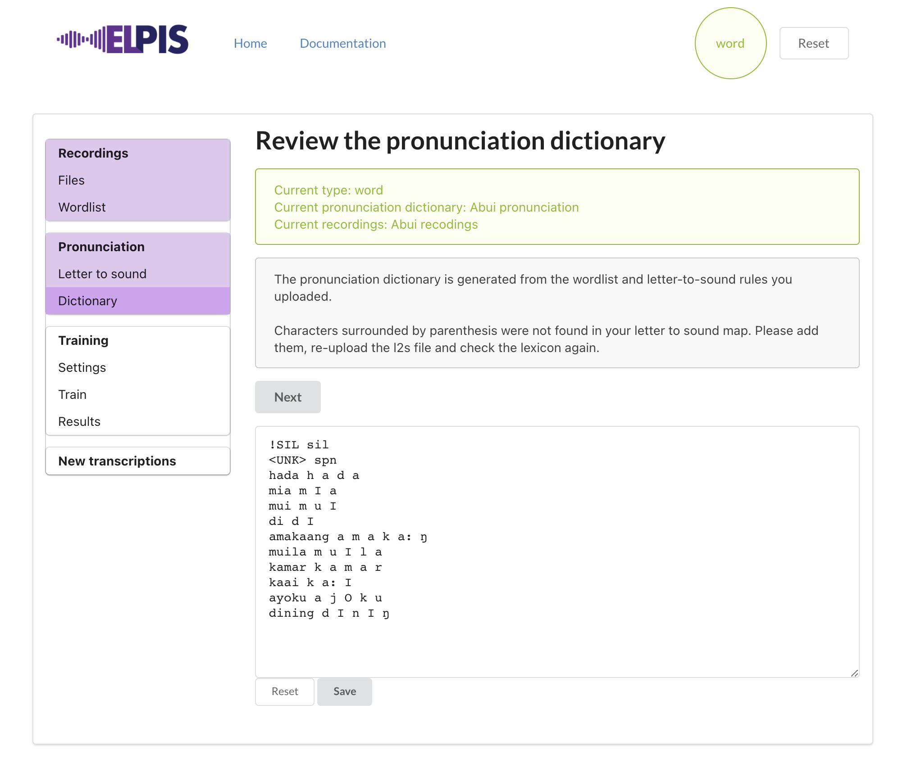

> The `!SIL` and `<unk>` lines are used to handle silence and unknown words.
>
> Check words that have been transcribed with consecutive matching characters. Do they represent one sound or two? If only one, add a line to your `letter-to-sound.txt` file, mapping the consecutive characters to a single symbol and rebuild the lexicon.
>
> For example, if `wu̱nne̱` is mapped to `wu̱nne̱ w ɨ n n ɛ` in the lexicon, then add `nn n` to `letter-to-sound.txt`, upload it again and rebuild the lexicon.  The results should be collapsed lexicon entry `wu̱nne̱ w ɨ n ɛ`.
>
> If your language has digraphs, put these earlier in the l2s, above single characters. For example,
>
> ```
> ng ŋ
> n n
> ```


---


# Training sessions

Now our training files have been prepared, we can start a new training session. Give it a name then click Next.

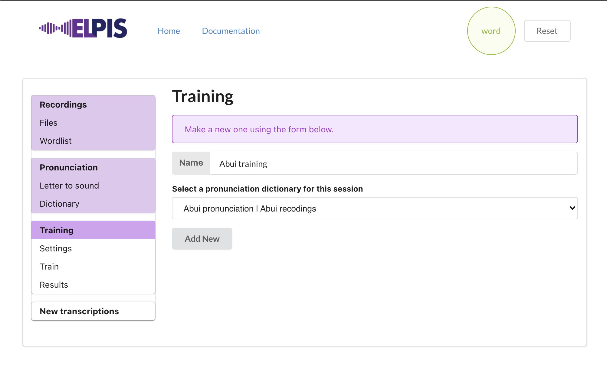


## Settings

Here you can adjust settings which affect the tool's performance. A unigram (1) value will train the model on each word. A trigram (3) value with train the model by words with their neighbours.

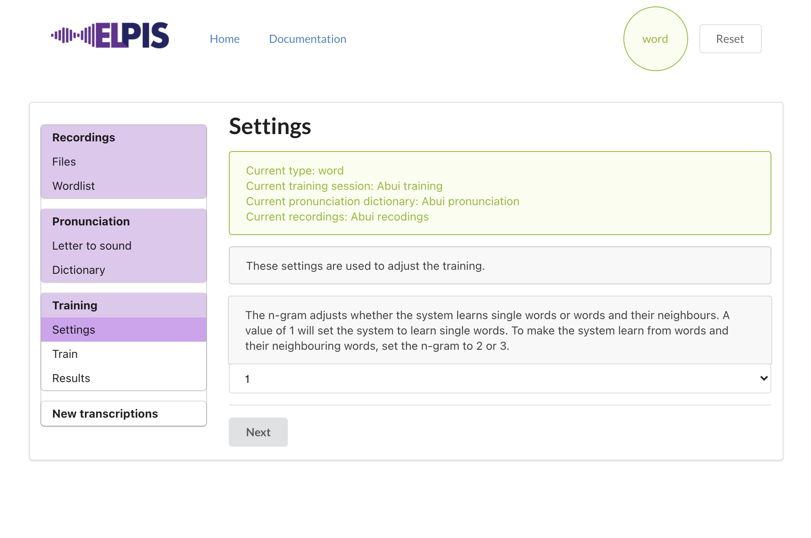


## Training

Go to the **Training** page and press `Start training` to begin.

During training, we will see progress through the stages. The terms here are speech recognition jargon words. Understanding what they mean is not required to use Elpis. Depending on the duration of your training recordings, Elpis can take a long time to train.During these long training processes, seeing the terms here can at least indicate that the process is still going. As each stage completes, it will show a little tick. 

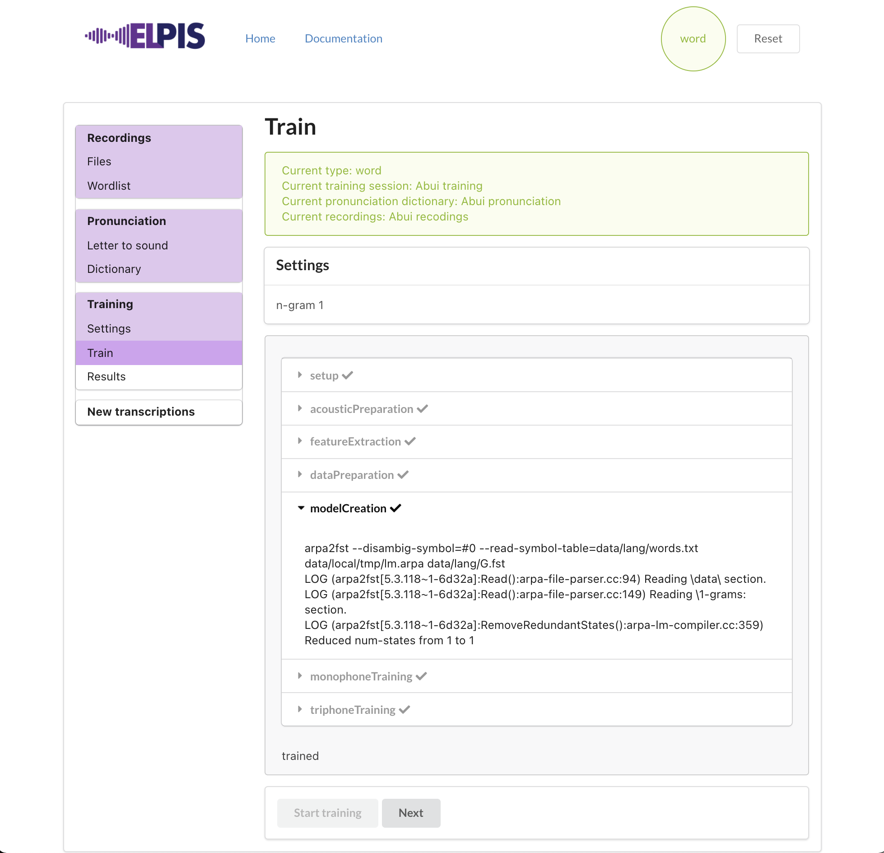


## Results

When training is complete, go to the Results page to see the results for this training session. These results tell us how the training went, and help us to understand what happened in the training process. These numbers are **scored** by comparing the words in one of the original transcriptions against the computer's version.

The results are:

- WER - Word Error Rate
- Count - a word count of how many words were wrong compared with the total number of words in the sample
- DEL - words that were deleted (missed)
- INS - words that have been inserted (added)
- SUB - words that have been substituted (mistaken)

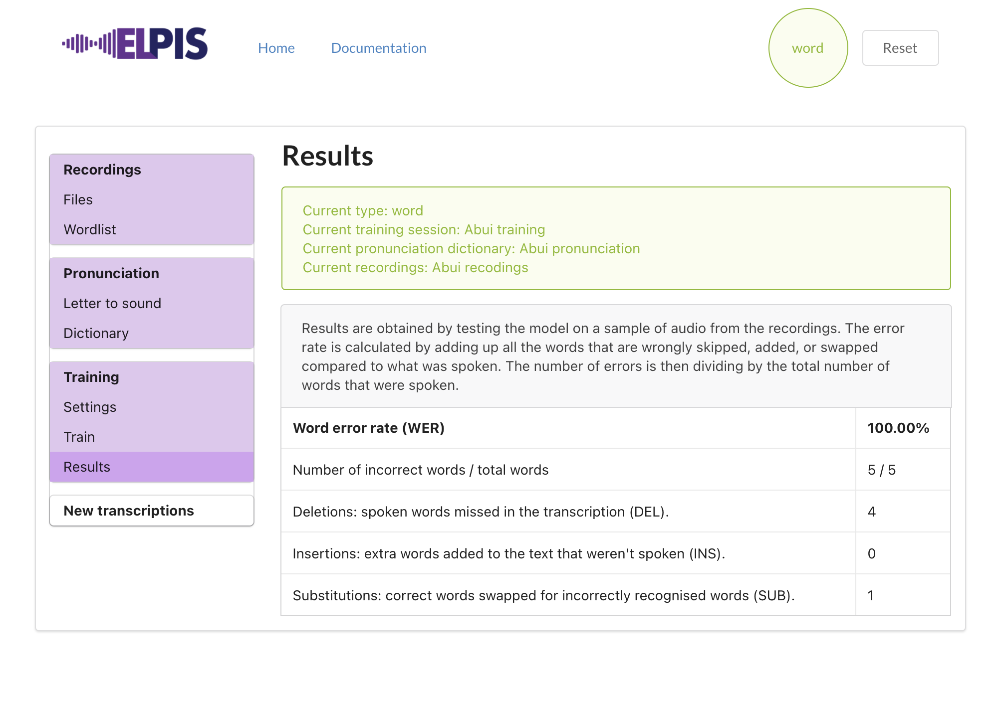


----

# Making a new transcription

Now the training has completed, go to the **New Transcriptions** step.

Click `Upload`, navigate to the files you downloaded and select the `audio.wav` file from the Abui untranscribed folder. Then click `Transcribe`. 

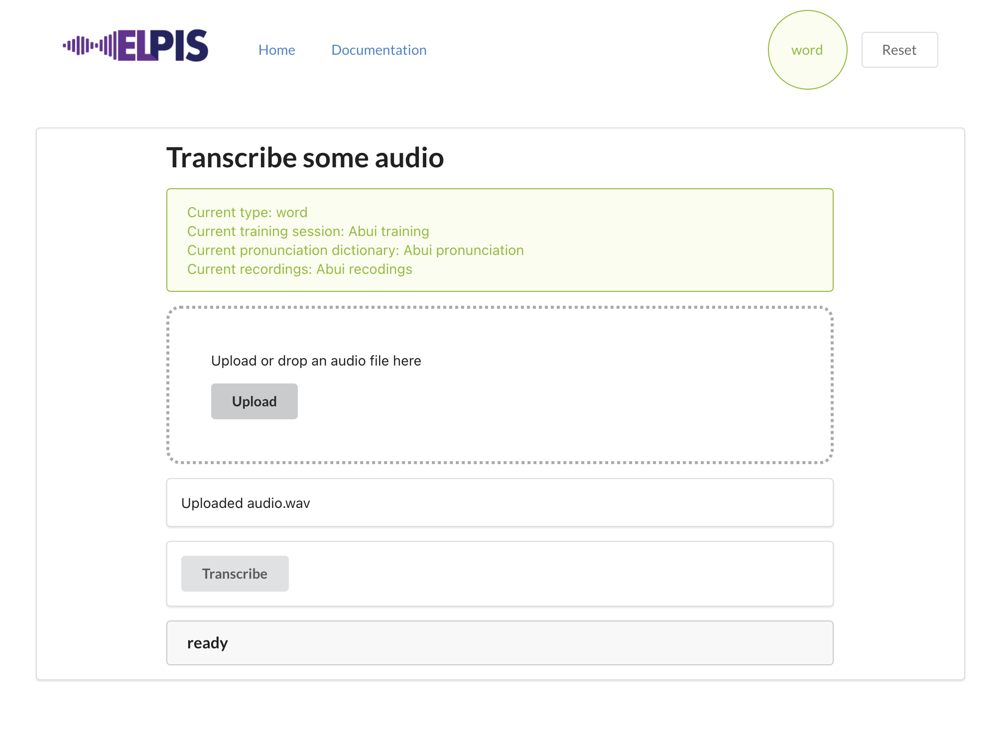


Again, we see progress through the transcription stages, and more speech recognition jargon! 

After the transcription is done, the transcription will show on the page, and the transcription can be downloaded in text or Elan format.

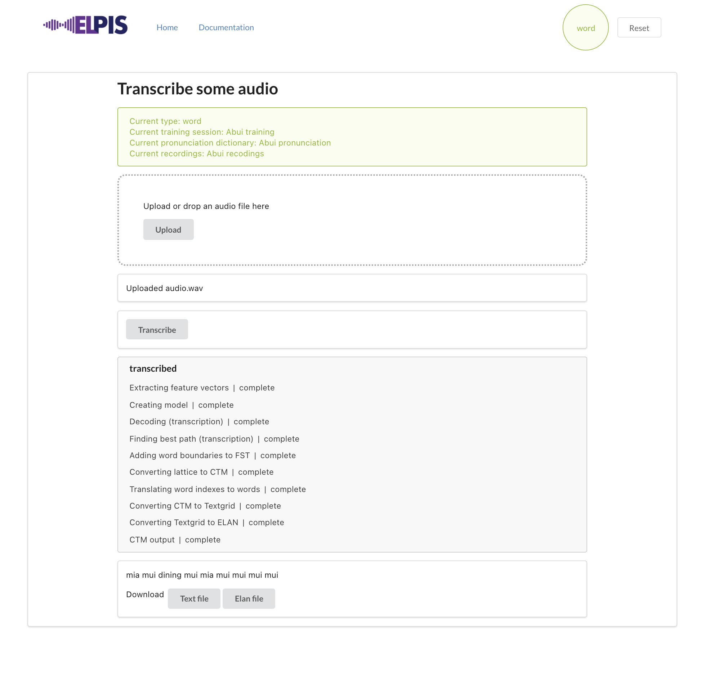


Listen in Elan.
> If you are using your own audio, rename the audio to `audio.wav`.

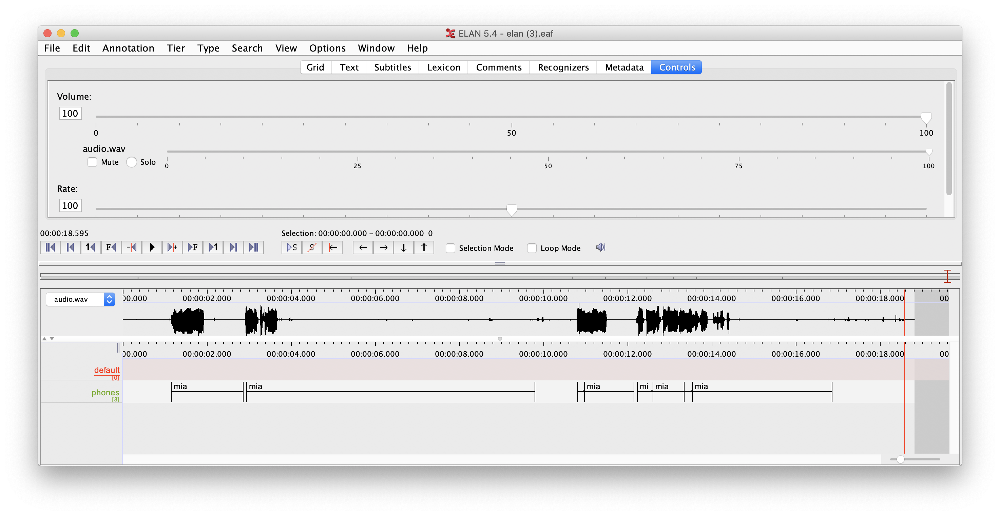


---

# More information about training files

The system trains with existing audio recordings and transcriptions. Generally, the more hours of training recordings you can train with, the better the results. However, it’s not simply a matter of throwing everything you have into a bucket. Time spent cleaning and fine-tuning your existing transcriptions will have a good impact on your results.

You will typically get better results with few hours of files by using recordings from a common recording activity, e.g. short sentences, or stories, or word-repetition exercises.

For Elpis, the file format requirements are:

a) WAV audio, preferably 44.1kHz mono but the system can convert stereo files and resample from different sample rates.

b) Orthographic transcription of the audio. For today’s workshop, the interface is using Elan transcriptions, soon we will be able to use text files.

> We have other tools that will convert TextGrid and Transcriber files and will integrate this in the near future. Please let us know about your own file formats so we can include them in future versions!

c) Filenames of the transcription must match the audio filename.

> We are working on different ways to deal with this but for now, these are best done manually.

Transcriptions don’t need to be word level. Annotations at an utterance/phrase level are fine.

Clean your transcriptions by looking through them and checking the following:

- Standardise variation in spelling
* Replace non-lexical number forms, shorthand forms and abbreviations with full lexical forms. For example, replace ‘9’ with ‘nine’.
- For more cleaning tips, see the [Data preparation](preparing-files.md) wiki page.


You can also add text files that contain words in the language, that don't have matching audio. These will be used to improve the system's language model.
