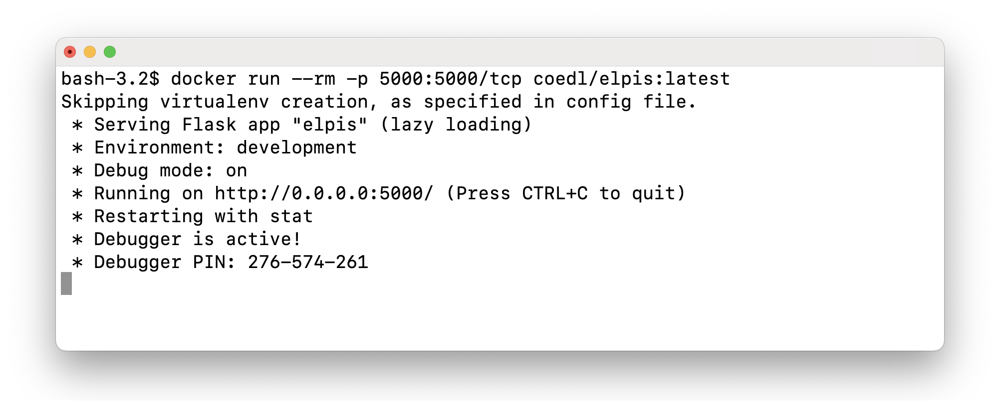

# Installing Elpis with Docker

Elpis can be installed with Docker, a virtual computer running on **your** computer. To use this version of Elpis, you first need to install Docker.


Docker is a program which helps standardise the way we do computational tasks with data, regardless of the operating systems of all the people who might want to run those tasks. Rather than building separate code for Windows, Linux, Mac operating systems, we can write once and run it on a myriad of operating systems using Docker. For more information about Docker, view [Nay San's slides](http://goo.gl/qxQDPP).

[Follow the instructions on the Docker site to install Docker.](https://www.docker.com/products/docker-desktop)
You will need to create a (free) account with them to be able to download the Docker installer.


After you have installed Docker, start it. On a Mac, you will see a little whale icon in the top menu bar. On Windows you'll see a whale icon in the system tray.

With Docker running, we will use a **terminal** to install Elpis.

 > When you use an application like Elan or Word, you are using a 'graphical user interface (GUI)' to do stuff to your data via menus and buttons. Another way of interacting with your computer is via a terminal, also known as a command line or command prompt.

On Mac, open the *Terminal* app in your *Applications > Utilities* folder.

For Windows, open the search field in your taskbar, type  `command` or `cmd` into it. Then, click or tap on the *Command Prompt* result to open it.

Download and run the Elpis Docker image by pasting this command in a terminal and pressing `Return` (or `Enter`).

```
docker run --rm -p 5001:5001/tcp coedl/elpis:latest
```


If this is the first time you have run the command, you should see a message "Unable to find image 'coedl/elpis:latest' locally". All this means is that Docker has looked to see if there's a local copy of the Docker image, and couldn't find one. It will then start to download the image in a series of "layers". Each layer will go through a process of Waiting and Pulling (pulling involves Downloading and Extracting). When all layers are complete, Docker will create a container from the image and start Elpis in the container.

When you see a message about the server running, open `http://0.0.0.0:5001` in a browser.




You should see the Elpis interface. It might look a little different to this, depending on changes in the current version.


With Elpis going, follow the steps in the [Elpis online workshop](elpis-workshop.html).
