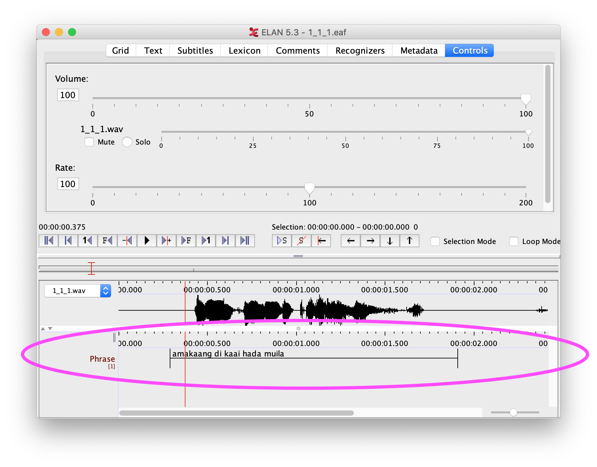

# Preparing files

Speech recognition systems train on pre-transcribed speech data, building a statistical model of speech, which can then be applied to untranscribed speech. It is important to recognise that the type of speech that the system trains on will determine the type of speech that the trained model can be used on. For example if you train a system with speech of a person counting numbers, that model will be great for automatically transcribing more speech of that person counting, but wouldn’t be practical for transcribing a different person telling stories.

Select a collection of data for which you have the most orthographically-transcribed, high-quality speech recordings. The system will learn from these to build a model for the language.

## Preparing your existing transcriptions

Choose a set of data from your corpus. For maximum success in the workshop, use orthographically-transcribed content from a single speaker. Select data from a common recording activity, e.g. short sentences, or stories. The current version of Elpis uses Elan files. Let us know if you have other transcription file formats, as we are currently working on adding other transcription formats.

Duplicate your data set so that you don’t affect your original data by preparing for this workshop, as some of the workshop steps are destructive.

Identify which Elan tier the transcriptions are on that you want the system to learn, and ensure that this “target” tier is named consistently across all the files in this corpus. 

## Clean your transcriptions by looking through them and checking the following:

- Reduce inconsistencies or typos in transcriptions.
- Standardise variation in spelling.
- Replace non-lexical number forms, shorthand forms and abbreviations with full lexical forms. For example, replace ‘9’ with ‘nine’.
- Code-switching in a single tier will confuse the system. Although it is possible to train a multi-lingual system, in this workshop we will focus on one language. Separate multiple languages by creating one tier for the language you want to train.
- Out-of-vocabulary words (words that are in the corpus but not in the lexicon) will reduce the accuracy. Ensure that everything in the speech signal is transcribed.
- Remove inline conventions such as speaker or language codes.
- Remove punctuation that is not lexically significant

## Audio

Elpis trains using 16 bit, 44.1kHz, mono WAV format audio. It will convert WAV files to the required specification, however converting your audio to these specifications beforehand will reduce the training time.
- 16 bit is the bit-depth, the number of values in each audio sample. 
- 44.1kHz is the sample rate, also known as the sample frequency.
- Mono refers to the audio having only a single channel, rather than stereo being two channels.

Ensure the audio is in WAV format. MP3 is not suitable because the MP3 compression removes much of the information in the audio signal. Converting from MP3 to WAV doesn't work either, as the information lost in the compression is not recovered in conversion. 

Audio filenames should match the transcript filenames, bearing in mind that any commas, spaces, pipes, etc. in the filenames will cause problems. Rename your filenames to only use alphanumeric with underscores or dashes.

Use noise reduction techniques to clean the audio signal if needed.

## Examples

For examples, refer to the [Abui toy corpus](https://elpis.net.au/abui.zip).
